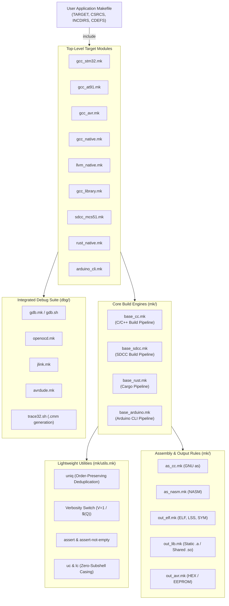
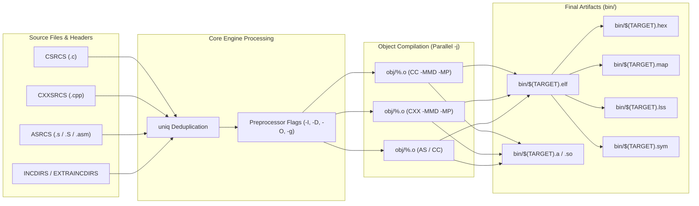

# mk-build-raccoon 🦝

[](https://www.gnu.org/software/make/)
[](https://github.com/neoelec/mk-build-raccoon)
[](https://github.com/neoelec/mk-build-raccoon)
[](https://github.com/neoelec/mk-build-raccoon)
[](https://opensource.org/licenses/MIT)

**`mk-build-raccoon`** is a modular, high-performance GNU Make build framework and cross-compilation toolkit designed for embedded firmware, bare-metal kernels, and native applications. Providing a clean, declarative component interface inspired by **Kbuild** and **ChibiOS**, it delivers zero-dependency modularity, automatic order-preserving deduplication, instant compilation pipeline configuration, and comprehensive debugger integration (GDB, OpenOCD, Segger J-Link, AVRDUDE, Bochs, and Lauterbach TRACE32).

---

## 🌟 Key Features

- **Multi-Toolchain & Cross-Compilation Support**:
  - **ARM Cortex-M & Classic ARM**: `gcc_stm32.mk` (STM32F4 series, HAL, CMSIS, FreeRTOS), `gcc_at91.mk` (Microchip/Atmel AT91SAM7S).
  - **Atmel / Microchip AVR**: `gcc_avr.mk` (ATmega128 and AVR family, Intel HEX, EEPROM binary).
  - **8051 & Legacy Microcontrollers**: `sdcc_mcs51.mk` (Intel MCS-51, DS80C390, Z80, STM8, PDK via SDCC).
  - **x86 OS & Bare-metal**: `gcc_x86_os.mk` (32-bit flat binary multi-stage bootloaders & kernels).
  - **Native C/C++ Applications**: `gcc_native.mk` (Host Linux GCC with GDB integration) and `llvm_native.mk` (Clang + LLD + LTO).
  - **Static & Dynamic Libraries**: `gcc_library.mk` (Automated `.a` archiving, `.so` shared objects, and semantic soname symlinks).
  - **Modern Ecosystems**: `rust_native.mk` / `base_rust.mk` (Cargo release/debug pipelines) and `arduino_cli.mk` (Arduino CLI auto-detection & flashing).
  - **Architecture Modeling**: `base_puml.mk` (PlantUML automatic JAR resolution, download, and SVG rendering).
- **Kbuild & ChibiOS Inspired Architecture**:
  - **Declarative Component Interfaces**: Cleanly aggregate sources and flags (`CSRCS += ...`, `CXXSRCS += ...`, `ASRCS += ...`, `INCDIRS += ...`, `CDEFS += ...`).
  - **Order-Preserving Deduplication (`uniq`)**: Kbuild `strip-duplicates` algorithm prevents duplicate object compilation and preserves critical link/include ordering.
  - **Dual Verbosity Execution (`V=1` / `$(Q)`)**:
    - Default (`V=0`): Clean, quiet modern banners (`Compiling: ...`, `Linking: ...`, `Archiving: ...`).
    - Verbose (`V=1`): Full compiler and linker command-line invocations for diagnostics.
- **Zero Parse-Time Subshell Overhead**:
  - All directory paths resolved via pure GNU Make built-ins (`$(abspath $(lastword $(MAKEFILE_LIST)))` and `$(patsubst %/,%,$(dir ...))`).
  - Fast, pure-Make character lookup tables for uppercase/lowercase string conversion (`$(call uc,...)`, `$(call lc,...)`) with zero subshell invocations (`$(shell ...)` eliminated).
- **Hardened Safety & Assertion Engine**:
  - Automatic validation of required variables (`$(call assert-not-empty,TARGET,...)`) prevents corrupted output builds while gracefully handling clean targets.
  - Automatic directory creation guards (`@mkdir -p $(dir $@)`) for objects, binaries, and listing files.
- **Integrated Multi-Protocol Debugging Suite**:
  - GDB (`localhost` and `remote` server sessions with automatic `.gdbinit` generation).
  - OpenOCD on-chip debugger and flash programming (`openocdflash`, `openocdgdb`).
  - Segger J-Link / J-Flash (`jflash`, `jlinkgdb`).
  - AVRDUDE programmer (`avrdude`).
  - Bochs PC emulator runner (`run`, `test`).
  - Lauterbach TRACE32 practice script generation (`trace32_cmm`).

---

## 🏗️ System Architecture



### Compilation & Linking Pipeline



---

## ⚡ Performance & Architectural Highlights

- **Order-Preserving List Deduplication (`uniq`)**:
  Standard GNU Make `$(sort ...)` alphabetizes words, which corrupts linker library resolution order and include search precedence. `mk-build-raccoon` uses a pure recursive Make function:
  ```makefile
  uniq = $(strip $(if $(1),$(firstword $(1)) $(call uniq,$(filter-out $(firstword $(1)),$(1)))))
  ```
- **Zero Parse-Time Subshell Invocations**:
  Spawning subshells (`$(shell ...)`) during Makefile parsing drastically slows down build analysis, especially on Windows/WSL and large source trees. All module paths use built-in path expansions, and casing transformations use instantaneous character lookup tables:
  ```makefile
  uc = $(subst a,A,$(subst b,B,...,$(subst z,Z,$(1))...))
  ```
- **Kbuild Verbosity Control**:
  Clean output by default keeps terminal output concise and easily readable. Append `V=1` to inspect full toolchain options:
  ```bash
  make        # Clean banners: Compiling: main.c, Linking: bin/app.elf
  make V=1    # Full compiler invocations displayed
  ```
- **Atomic Tool Downloads**:
  Helper utilities like [`mk/down_puml.sh`](file:///home/neoelec/iHDD00/08.PROJECT/mk-raccoon/mk/down_puml.sh) download into temporary files with trap-based cleanup, ensuring incomplete downloads never corrupt the local repository.

---

## 📋 Supported Target Modules & Toolchains

| Module | Architecture / Target | Default Toolchain | Output Artifacts | Debugger Integration |
| :--- | :--- | :--- | :--- | :--- |
| **`gcc_stm32.mk`** | ARM Cortex-M (STM32F4xx / Nucleo / Disco) | `arm-none-eabi-gcc` | `.elf`, `.map`, `.lss`, `.sym` | OpenOCD, Trace32, GDB |
| **`gcc_at91.mk`** | ARM7TDMI (Microchip/Atmel AT91SAM7S) | `arm-none-eabi-gcc` | `.elf`, `.map`, `.lss`, `.sym` | Segger J-Link / J-Flash, Trace32 |
| **`gcc_avr.mk`** | 8-bit AVR (ATmega128, etc.) | `avr-gcc` | `.elf`, `.hex`, `.eep`, `.map` | AVRDUDE |
| **`sdcc_mcs51.mk`** | Intel MCS-51 / 8051, Z80, STM8 | `sdcc` / `sdas` | `.ihx`, `.hex`, `.cdb`, `.omf` | Paulmon v2.1 |
| **`gcc_native.mk`** | Host Linux x86_64 / AArch64 | `gcc` / `g++` | Stripped executable, `.elf` | GDB (`localhost`, `remote`), Trace32 |
| **`llvm_native.mk`**| Host Linux x86_64 / AArch64 | `clang` / `clang++` + LLD | Stripped executable, `.elf` | GDB, LLDB |
| **`gcc_library.mk`**| Host / Cross C/C++ Libraries | `ar` / `gcc` / `g++` | Static `.a`, Dynamic `.so`, `.so.X` | GDB |
| **`rust_native.mk`**| Rust Applications / Crates | `cargo` | `target/debug/`, `target/release/` | Rust-GDB |
| **`arduino_cli.mk`**| Arduino Hardware Ecosystem | `arduino-cli` | `.elf`, `.hex`, `.bin` | InoDbg (J-Link / OpenOCD) |

---

## 🔌 Debugger & Hardware Tool Integrations

| Tool | Trigger Command | Targets Supported | Features |
| :--- | :--- | :--- | :--- |
| **GDB (Local)** | `make gdb_localhost` | Native, LLVM, Rust | Auto-creates `.gdbinit`, breaks at `_start`, sets testflags |
| **GDB (Remote)** | `make gdb_remote` | STM32, AT91, Native | Connects to `localhost:2331` (or custom port) |
| **GDB Server** | `make gdbserver` | Native, LLVM | Launches `gdbserver` daemon with target binary |
| **OpenOCD** | `make openocdflash`<br/>`make openocdgdb` | STM32 | Direct flash programming via SWD/JTAG, GDB server bridge |
| **Segger J-Link**| `make jflash`<br/>`make jlinkgdb` | AT91SAM7S, STM32 | High-speed flash programming via J-Flash, J-Link GDB server |
| **AVRDUDE** | `make avrdude` | ATmega AVR | Automatic Flash (`.hex`) and EEPROM (`.eep`) ISP programming |
| **Bochs** | `make run` / `make test` | x86 Bare-metal OS | Floppy image simulation with `bochsrc` and `bochscmd` |
| **Paulmon** | `make paulmon` | 8051 / SDCC | TTY upload of Intel HEX code to Paulmon v2.1 monitor |
| **Lauterbach** | `make trace32_cmm` | STM32, AT91, Native | Generates practice script (`target.cmm`) for TRACE32 |

---

## 🚀 Quick Start & Usage Examples

### 1. Native C/C++ Application (`gcc_native.mk`)

Create a `Makefile` in your project directory:

```makefile
TARGET   := my_app
CSRCS    := src/main.c src/utils.c
CXXSRCS  := src/engine.cpp
INCDIRS  := include /opt/custom/include
CDEFS    := -DAPP_VERSION=\"1.0.0\"
OPT      := 2

# Include mk-build-raccoon native build module
include /path/to/mk-build-raccoon/gcc_native.mk
```

Build, test, run, and clean:
```bash
make          # Build executable (bin/my_app)
make run      # Execute binary directly
make V=1      # Build with verbose toolchain command output
make clean    # Remove build artifacts (obj/, bin/)
```

---

### 2. STM32 Firmware Development (`gcc_stm32.mk`)

```makefile
TARGET      := stm32_firmware
BOARD       := nucleo-f439zi
PLATFORM    := nucleo-f439zi
CHIP        := STM32F439zi
STM32CUBE_DIR := /opt/STM32CubeF4

CSRCS       := src/main.c src/gpio.c
INCDIRS     := inc

include /path/to/mk-build-raccoon/gcc_stm32.mk
```

Flash and debug:
```bash
make                 # Build bin/stm32_firmware-nucleo-f439zi-STM32F439zi.elf
make openocdflash    # Program flash memory via OpenOCD
make openocdgdb      # Launch OpenOCD GDB server
```

---

### 3. Static & Dynamic C/C++ Library (`gcc_library.mk`)

```makefile
TARGET     := libcore
VERSION    := 1
PATCHLEVEL := 0
SUBLEVEL   := 0

CSRCS      := src/core.c src/crypto.c
INCDIRS    := include

include /path/to/mk-build-raccoon/gcc_library.mk
```

Build produces:
```text
bin/
├── libcore.a
├── libcore.so -> libcore.so.1.0.0
├── libcore.so.1 -> libcore.so.1.0.0
└── libcore.so.1.0.0
```

---

### 4. 8051 / MCS-51 Firmware with SDCC (`sdcc_mcs51.mk`)

```makefile
TARGET   := blink51
MCU      := mcs51
F_CPU    := 11059200
CSRCS    := main.c timer.c
INCDIRS  := inc

include /path/to/mk-build-raccoon/sdcc_mcs51.mk
```

Build produces:
* Intel HEX (`bin/blink51.hex`)
* SDCC CDB debug symbol file (`bin/blink51.cdb`)
* Memory allocation map (`bin/blink51.mem`)

---

## 📂 Directory Structure

```text
mk-build-raccoon/
├── gcc_at91.mk               # AT91SAM7S ARM7TDMI build module
├── gcc_avr.mk                # Atmel AVR ATmega build module
├── gcc_library.mk            # Static (.a) and dynamic (.so) library module
├── gcc_native.mk             # Native Linux GCC application module
├── gcc_stm32.mk              # STM32 Cortex-M ARM build module
├── llvm_native.mk            # Native Clang/LLVM + LLD application module
├── rust_native.mk            # Rust Cargo build module
├── sdcc_mcs51.mk             # SDCC 8051 / MCS-51 build module
├── arduino_cli.mk            # Arduino CLI build and upload module
├── dbg/                      # Debugger & hardware programmer drivers
│   ├── avrdude.mk            # AVRDUDE programming integration
│   ├── gdb.mk                # GDB localhost & remote launcher
│   ├── gdb.sh                # .gdbinit dynamic script generator
│   ├── inodbg.mk             # Arduino InoDbg driver
│   ├── jlink.mk              # Segger J-Link & J-Flash driver
│   ├── openocd.mk            # OpenOCD flash & GDB driver
│   ├── paulmon.mk            # Paulmon v2.1 8051 upload driver
│   └── trace32.sh            # Lauterbach TRACE32 practice script generator
└── mk/                       # Core build framework engines
    ├── utils.mk              # Core utilities (uniq, assert, uc, lc, V/Q)
    ├── base_cc.mk            # Standard C/C++ compilation pipeline
    ├── base_sdcc.mk          # SDCC microcontroller compilation pipeline
    ├── base_rust.mk          # Cargo compilation engine
    ├── base_arduino.mk       # Arduino CLI compilation engine
    ├── base_cmsis.mk         # ARM CMSIS Core & RTOS integration
    ├── base_freertos.mk      # FreeRTOS kernel module
    ├── as_cc.mk              # GNU Assembler (as) rule engine
    ├── as_nasm.mk            # Netwide Assembler (NASM) rule engine
    ├── out_elf.mk            # ELF, LSS, and symbol table generator
    ├── out_lib.mk            # Static & dynamic library linker
    ├── out_avr.mk            # AVR Flash & EEPROM image generator
    ├── base_puml.mk          # PlantUML diagram rendering pipeline
    ├── down_puml.sh          # Atomic PlantUML downloader
    ├── stm32/                # STM32 platform, series, and chip definitions
    ├── at91/                 # AT91 platform and board definitions
    └── freertos/             # FreeRTOS version configurations
```

---

## ⚙️ Configuration & Variable Reference

### Common Project Configuration

| Variable | Default | Description |
| :--- | :--- | :--- |
| **`TARGET`** | *(Required)* | Base target name without file extension |
| **`BINDIR`** | `bin` | Output directory for binaries, libraries, and images |
| **`OBJDIR`** | `obj` | Output directory for intermediate object files (`.o`, `.d`) |
| **`CSRCS`** | *(Empty)* | List of C source files (e.g. `main.c utils.c`) |
| **`CXXSRCS`**| *(Empty)* | List of C++ source files (e.g. `app.cpp engine.cpp`) |
| **`ASRCS`** | *(Empty)* | List of Assembler source files (e.g. `startup.s`) |
| **`INCDIRS`** | *(Empty)* | Include directories (ChibiOS style, automatically `-I` prefixed) |
| **`EXTRAINCDIRS`** | *(Empty)*| Additional include directories (backward compatibility) |
| **`CDEFS`** | *(Empty)* | Preprocessor macro definitions (e.g. `-DDEBUG=1`) |
| **`OPT`** | `s` | Optimization level (`0`, `1`, `2`, `3`, `s`) |
| **`DEBUG`** | *(Empty)* | Debug format flag (e.g. `g` or `3`) |
| **`V`** | `0` | Verbosity control (`0` = clean quiet output, `1` = verbose) |

### Toolchain Variables

| Variable | Default (Native) | Overridable Example | Description |
| :--- | :--- | :--- | :--- |
| **`CROSS_COMPILE`** | *(Empty)* | `arm-none-eabi-` | Cross-compilation toolchain prefix |
| **`CC`** | `$(CROSS_COMPILE)gcc` | `clang` | C compiler executable |
| **`CXX`** | `$(CROSS_COMPILE)g++` | `clang++` | C++ compiler executable |
| **`LD`** | `$(CXX)` | `ld` | Linker executable |
| **`AR`** | `$(CROSS_COMPILE)ar` | `llvm-ar` | Archiver executable |
| **`OBJCOPY`** | `$(CROSS_COMPILE)objcopy` | `llvm-objcopy` | Object copy executable |
| **`OBJDUMP`** | `$(CROSS_COMPILE)objdump` | `llvm-objdump` | Object dump executable |
| **`SIZE`** | `$(CROSS_COMPILE)size` | `llvm-size` | Binary size utility |

---

## 📄 License

This project is licensed under the **MIT License**. See the [LICENSE](LICENSE) file for details.  
Copyright (c) 2024–2026 **YOUNGJIN JOO** ([neoelec@gmail.com](mailto:neoelec@gmail.com)).
